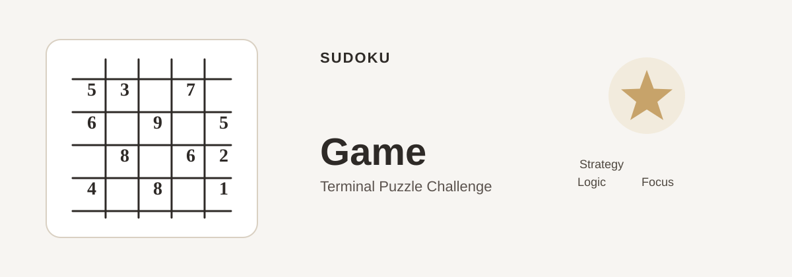

# Sudoku Game

A terminal-based Sudoku game built with Python. The player chooses a difficulty, fills empty cells, uses limited hints, and completes the board by following Sudoku rules.




## About the Project

This project is a small terminal game built to practice Python programming, logic validation, and game flow. It includes a main menu, difficulty selection, move checking, hint usage, score tracking, and a solver for validating completed boards.

The game uses the Python standard library only and does not require any external dependencies.

## Features

- 9x9 Sudoku board with visible 3x3 box separation
- Easy, Medium, and Hard difficulty levels
- Randomly selected puzzle patterns
- Fixed clue protection so original puzzle values cannot be overwritten
- Input validation for row, column, and number entries
- Hint system with a limited number of hints per game
- Score and mistake tracking
- Main menu with instructions and replay support
- Backtracking solver and validation checks for completed Sudoku boards
- Simple unit test coverage for game logic

## Technologies Used

- Python 3
- Git
- GitHub
- Python standard library modules such as `random`, `copy`, `typing`, and `unittest`

## How the Game Works

1. Start the game from the main menu.
2. Choose a difficulty level.
3. View the Sudoku board and identify empty cells.
4. Enter a move in the format `row column number`.
5. The program checks whether the move follows Sudoku rules.
6. Use a hint if needed, track points, and continue until the puzzle is solved.
7. The game confirms success only when the board is fully complete and valid.

## Project Structure

```text
Suduko/
|-- main.py
|-- sudoku.py
|-- test_sudoku.py
|-- requirements.txt
|-- README.md
`-- assets/
    `-- sudoku-hero.svg
```

## Installation

Clone the repository and move into the project folder:

```bash
git clone <repository-url>
cd Suduko
```

This project uses Python's built-in standard library, so no additional package installation is required.

## How to Run

From the project directory, run:

```bash
python main.py
```

On Windows, this also works:

```bash
py main.py
```

You can also open `main.py` in VS Code and use the editor's Run Python File option.

## Controls

- `1` to start a new game
- `2` to view instructions
- `3` to quit the game
- Enter moves as `row column number` such as `3 5 7`
- Enter `h` for a hint
- Enter `q` or `0 0 0` to exit the current game

Rows and columns are numbered from 1 to 9, and empty cells appear as `.` in the terminal output.

## Difficulty Levels

- Easy: a puzzle with more clues visible
- Medium: a puzzle with more empty cells than Easy
- Hard: the most difficult version available in this project

The project uses a known valid completed Sudoku board, so each puzzle is solvable.

## Scoring

- Start: 100 points
- Correct move: +2 points
- Incorrect move: -5 points and one mistake added
- Hint used: -10 points
- Score cannot go below zero

## Example Gameplay

```text
Difficulty: Medium
Score: 100 | Mistakes: 0 | Hints remaining: 3

    1 2 3   4 5 6   7 8 9
  +-------+-------+-------+
1 | 5 . . | 6 . . | 9 . . |
2 | . . . | 1 9 5 | . . . |
3 | . 9 8 | . . . | . 6 . |
4 | 8 . . | . 6 . | . . 3 |
5 | 4 . . | 8 . 3 | . . 1 |
6 | 7 . . | . 2 . | . . 6 |
7 | . 6 . | . . . | 2 8 . |
8 | . . . | 4 1 9 | . . 5 |
9 | . . . | . 8 . | . 7 9 |

Enter row column number, h for a hint, or q to quit: 1 2 3
Number placed successfully!
```

## Testing

The project includes a test suite for validation and solver behavior. Run it with:

```bash
python -m unittest test_sudoku.py -v
```

The tests check:

- valid and invalid move detection
- row, column, and box conflict validation
- fixed clue protection
- valid and invalid completed Sudoku boards
- solver correctness

## What I Learned

This project strengthened several core Python skills, including:

- program flow and menu logic
- conditional checks and input validation
- nested lists and board-state handling
- function design and modular structure
- debugging rule-based game logic
- writing tests for important behavior

## Future Improvements

These are realistic ideas that could be added later:

- a graphical interface
- a timer and leaderboard
- improved puzzle generation and difficulty tuning
- save/load game support
- a more advanced random puzzle system

## Author

A simple Python project focused on logic, game design, and problem-solving.
